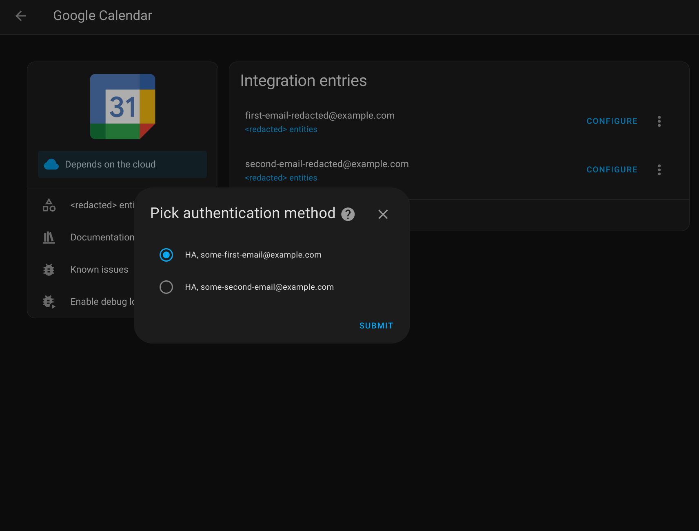

# Introduction

Calendars are annoying. I've found that my desire to have access to multiple disparate calendars in one spot, on all of my devices, without being constrained within a walled garden, and with voice-controlled scheduling, has been deceptively challenging to realize.

This article is intended as a living document where I can document my setup. Hopefully, someone finds it useful. 📆🌱

## Home Assistant, Google Calendar, CardDAV

I use [Home Assistant](https://www.home-assistant.io/), the [Home Assistant Companion app](https://companion.home-assistant.io/) for Android, and a custom calendar UI for Home Assistant from [Atomic Calendar Revive](https://github.com/totaldebug/atomic-calendar-revive) so I can access all of my calendars in one spot.

So as long as I can access my Home Assistant dashboard, I can access all of my calendars.

I connect to every calendar with Home Assistant's native integrations:
- I connect Home Assistant to Google calendars via the [Google Calendar integration](https://www.home-assistant.io/integrations/google/)
- I connect Home Assistant to CalDAV calendars via the [CALDAV integration](https://www.home-assistant.io/integrations/caldav/)

I *thought* the Google Calendar integration was unnecessary because Google lets you access *your* calendar via CalDAV. In practice, if you use Google Workspace for work, you can't subscribe to a coworker's calendar via CalDAV (if you can, it's not clear how). If you're trying to access calendars for Google Workspace accounts, I recommend using the Google Calendar integration.

## Contacts and Birthdays

I don't like using Google to store my contacts. A common recommendation among privacy-conscious Android users is to use a CardDAV server (e.g., as part of a Nextcloud server) along with [DAVx5](https://www.davx5.com/) to sync contacts from the CardDAV and the native Android contacts app.

I won't cover the use of DAVx5 or Nextcloud in-depth because they're covered extensively elsewhere. (I also ignore the paradox of attempting to maintain privacy on a software stack that sits on top of multiple radios running closed-source modem firmware in concert with Google Play Services).

In addition to my Google calendars, I use a CardDAV server where I store my contacts, and a CalDAV server which exposes the birthdays of those contacts as calendar events. Then I use the Home Assistant [CALDAV integration] to subscribe to the birthdays calendar. This lets me manage my contacts however I want, while still being able to see all of my contact's birthdays on my single calendar view in Home Assistant.

## Google Calendar Integration & Multiple Organizations
The Google Calendar integration connects to one or more Google organizations/accounts. Connecting one Google account is straightforward; connecting multiple is trickier.

*This part reads more like a tutorial; you don't need to know this to understand my setup.*

Setting up the integration for the first time for a single organization/account is [well-documented by Home Assistant](https://www.home-assistant.io/integrations/google/), so I won't cover it here. There are three important things to know:
- Home Assistant uses OAuth 2.0 to connect to the Google Calendar API
- Google Cloud has to be configured to enable OAuth 2.0
- Once you set up OAuth 2.0 for a given Google account, you have a client ID and client secret

My use case is a bit unique because I want to connect Home Assistant (HA) to (at least) *two* organizations' Google accounts:
- I want HA to connect to my company's calendars (Google Workspace)
- I want HA to connect to my personal calendar (personal Gmail)

The Google Calendar integration provides a clear UI to configure *one* organization in Home Assistant.
But there's no obvious way to configure *multiple* organizations.

My language is clunky here. I use "organization" to refer to a set of "accounts". If there are multiple accounts for a company using Google Workspace, I refer to these as belonging to the same organization. But I also refer to my personal Gmail account as an organization. Both the words "account" and "organization" are overloaded.

### The application_credentials File

I've found that the Google Calendar integration writes Google OAuth 2.0 creds to a file:  
`/config/.storage/application_credentials`.

After setting up the Google Calendar integration for the first time, this file might look like:
```json
{
  "version": 1,
  "minor_version": 1,
  "key": "application_credentials",
  "data": {
    "items": [
      {
        "id": "google_aaaaaaaaaaaa_bbbbbbbbbbbbbbbbbbbbbbbbbbbbbbbb_apps_googleusercontent_com",
        "domain": "google",
        "client_id": "aaaaaaaaaaaa-bbbbbbbbbbbbbbbbbbbbbbbbbbbbbbbb.apps.googleusercontent.com",
        "client_secret": "<client-secret>",
        "name": "HA, some-email@example.com"
      },
    ]
  }
}
```

Observe the following:
- `items` is an array; i.e, this format supports multiple *different* OAuth 2.0 clients, i.e., multiple *different* Google organizations.
- `id` is the `client_id` except with underscores (`_`) instead of dashes (`-`) and periods (`.`)
- `name` is an arbitrary string, it doesn't have to match anything in Google Cloud

Because I have (at least) two connections to two *different* Google organizations (*two* OAuth 2.0 clients), I've manually modified my `/config/.storage/application_credentials` file to contain two entries:

```json
{
  "version": 1,
  "minor_version": 1,
  "key": "application_credentials",
  "data": {
    "items": [
      {
        "id": "google_aaaaaaaaaaaa_bbbbbbbbbbbbbbbbbbbbbbbbbbbbbbbb_apps_googleusercontent_com",
        "domain": "google",
        "client_id": "aaaaaaaaaaaa-bbbbbbbbbbbbbbbbbbbbbbbbbbbbbbbb.apps.googleusercontent.com",
        "client_secret": "<some-first-oauth-secret>",
        "name": "HA, some-first-email@example.com"
      },
      {
        "id": "google_cccccccccccc_dddddddddddddddddddddddddddddddd_apps_googleusercontent_com",
        "domain": "google",
        "client_id": "cccccccccccc-dddddddddddddddddddddddddddddddd.apps.googleusercontent.com",
        "client_secret": "<some-second-oauth-secret>",
        "name": "HA, some-second-email@example.com"
      }
    ]
  }
}
```

**If you modify this file, be sure to restart Home Assistant.** I've found that a full reboot is the fastest way to get the Google Calendar integration to recognize the new credentials. (Go to `Settings > System` and click the power button in the top right corner).

### Adding Google Calendar Integration Entries
Once you've restarted Home Assistant, go to the Google Calendar Integration page (`Settings > Devices & services > Google Calendar`, or use your web browser to navigate to `http(s)://<your-hostname>:<your-port>/config/integrations/integration/google`). Then click "ADD ENTRY".

When I do this on my end, I see a nice dropdown:



**I only see a dropdown on this page when the `items` array in `/config/.storage/application_credentials` has more than one item in it.**

If `items` contains only one item (i.e., if there's only one configured OAuth 2.0 client), then by default clicking `ADD ENTRY` kicks off an OAuth 2.0 flow with the client ID and client secret from that item. In other words, there's no dropdown.

## Home Assistant Calendar Entities

Regardless of a Home Assistant calendar's provenance (whether it comes from the Google Calendar integration, the CalDAV integration, or some other integration), Home Assistant treats all calendars the same. They all end up as calendar entities.

Calendar entities have an entity ID with the prefix `calendar.`. You can view all of the calendar entities by searching for this string on the entities page (which you can get to by going to `Settings > Devices & services` and clicking the `Entities` tab or by going to `http(s)://<your-hostname>:<your-port>/config/entities` in your browser's address bar).

To read more about calendar entities, see the [Calendar Entity docs](https://developers.home-assistant.io/docs/core/entity/calendar/).

## Atomic Calendar Revive

[Atomic Calendar Revive](https://github.com/totaldebug/atomic-calendar-revive) provides a custom calendar card for the Home Assistant dashboard (Lovelace).

It's important to understand that Atomic Calendar Revive just provides a UI. It displays events from calendar entities as the entities exist in Home Assistant.

It works well enough. Here's an example config to get you started:
```yaml
type: custom:atomic-calendar-revive
name: Calendar
entities:
  # An entity from a personal Google calendar
  - entity: calendar.eric_example_com
    name: Eric
    color: green
    icon: mdi:sprout
  # An entity from a CalDAV calendar that has birthdays from personal contacts
  - entity: calendar.eric_birthdays_example_com
    name: Birthdays
    color: blue
    icon: mdi:cake
  # An entity from a friend's CalDAV calendar
  - entity: calendar.dorothy_example_com
    name: Dorothy
    color: red
  # An entity from a coworker's Google calendar
  - entity: calendar.martin_luther_example_com
    name: Martin Luther King
    color: yellow
    icon: mdi:briefcase
  # An entity from a coworker's Google calendar
  - entity: calendar.malala_yousafzai_example_com
    name: Malala Yousafzai
    color: cyan
    icon: mdi:briefcase
  # An entity from a coworker's Google calendar
  - entity: calendar.nelson_mandela_example_com
    name: Nelson Mandela
    color: magenta
    icon: mdi:briefcase

showEventIcon: true
maxDaysToShow: 4
showWeekDay: true
showDate: true
defaultMode: Calendar
compactMode: true
showCalendarName: true
```

## On Convenience, Self-Honesty, and Gemini

I recently switched to using Google Calendar as my personal calendar. Before that, I used a CalDAV server to store events, [Etar](https://f-droid.org/en/packages/ws.xsoh.etar/) as my calendar client, and [DAVx5](https://www.davx5.com/) to manage syncing between Etar and the CalDAV server.

But if I'm being honest, I never *really* used this setup, because I was always too lazy to open my calendar app and type out an event.

[Gemini](https://en.wikipedia.org/wiki/Gemini_(chatbot)) (which has been rolling out on Android as a replacement to Google Assistant) makes it ridiculously easy to schedule events and reminders on Android via voice control. Unfortunately, I'm guessing Gemini does not and will not support integrations with third-party calendar apps such as Etar.

If you're privacy conscious, feel free to use a separate CalDAV server wired up to Home Assistant. You can do this alongside Google Calendar if need be. But, until there are better open-source alternatives for voice-controlled scheduling, I think I'll use Google Calendar. 🤷

## Home Assistant Redundancy

There's still one outstanding issue with my current setup. If my Home Assistant dashboard goes down, becomes inaccessible, or can't dial out to the internet, it takes down my ability to access my calendars with it.

I could still check individual calendars (e.g., by signing into my Google account like a normie), but the issue remains: **if you're going to use Home Assistant to access all of your calendars, you're making Home Assistant a single point of failure.** In my experience, the Home Assistant software itself is robust and stable. Just be cognizant of the risks in building what I would consider critical infrastructure around something you might maintain as a hobby.
