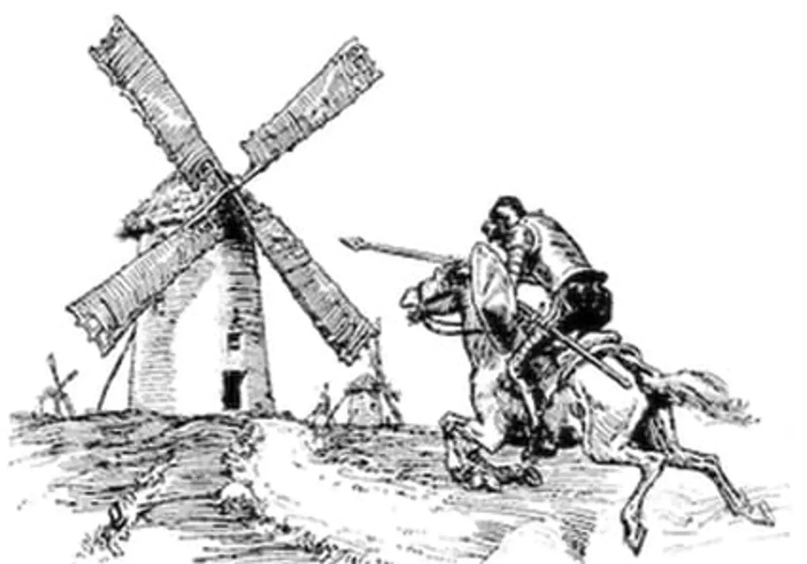

The Cleveland Air Show[^1][^2] sucks.

- Fighter jets kill people; they're not entertainment
- The Cleveland Air Show causes noise pollution
- The Cleveland Air Show causes air pollution

**Labor Day weekend should be a celebration of the labor movement and workers rights, not a jingoistic endorsement of the military-industrial complex.** Why should people across Greater Cleveland put up with the sound of fighter jets buzzing their homes and workplaces?
It's not just on Labor Day itself, either. The exercises start several days in advance.
And the organizers have the audacity to charge admittance!

The Cleveland Air Show sucks.

References

[^1]: Cleveland Air Show (Sep 3, 2023). ["Cleveland Air Show"](https://www.clevelandairshow.com/). Cleveland Air Show. [Archived](https://web.archive.org/web/20230903013215/https://www.clevelandairshow.com/) from the original on September 3, 2023. Retrieved September 3, 2023.  
[^2]: Cleveland Air Show Sponsors (Sep 3, 2023). ["Cleveland Air Show Sponsors"](https://www.clevelandairshow.com/partners/sponsors/). Cleveland Air Show Sponsors. [Archived](https://web.archive.org/web/20230323213435/https://www.clevelandairshow.com/partners/sponsors/) from the original on March 23, 2023. Retrieved September 3, 2023.  
