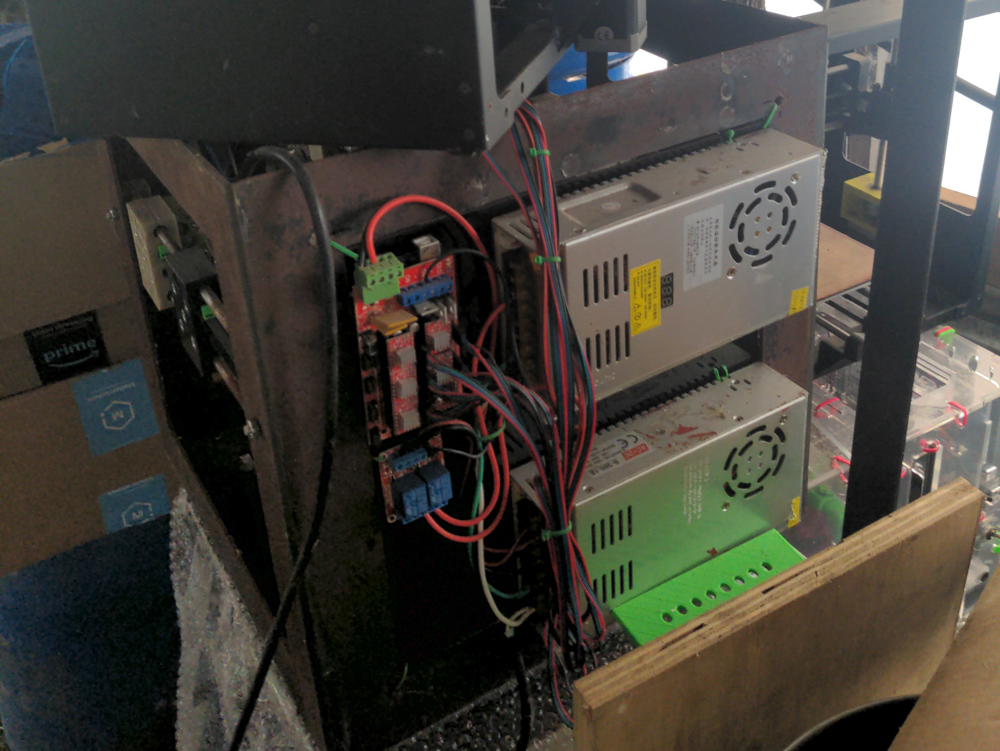

Last September (2021), I had the privilege to attend the [OSE Summer of Extreme Design-Build](https://www.opensourceecology.org/summer-x-2021/). During the early summer months in Cleveland, I signed up to attend one month of the 90-day program. As summer wound down, I wrapped up some software contracting work, picked up a pair of steel toe boots, loaded up my car, and drove 12 hours down to the middle-of-nowhere Missouri.

If you're not familiar with Marcin Jakubowski or Open Source Ecology (OSE), check out the [OSE website](https://www.opensourceecology.org/) and [OSE wiki](https://wiki.opensourceecology.org/wiki/Main_page).

*I am not paid by OSE. I am not affiliated with any of the legal/financial aspects of OSE. My opinions are my own and do not necessarily represent the opinions of Marcin Jakubowski nor OSE.*

## Setting Out

The OSE campus, [Factor e Farm (FeF)](https://www.opensourceecology.org/about-factor-e-farm/), is located about an hour north of Kansas City.
As a native Ohioan, used to winter-worn roads policied by the praetorian Ohio State Troopers, the drive through Missouri was serene. The freeways are in great shape and the roads stretch for miles into the horizon across America's heartland.

I neared Factor e Farm sometime around 10pm. While close to the freeway, getting to FeF requires
taking a side road delineated only by a small mile marker sign; there's not much of an exit ramp. Fortunately, the Missouri freeway system has another endearing quirk. Exits are spaced far apart, but the central median is intersected by small turn-arounds that allow you to change direction. After a driving in a few circles in the dark, I found the side road.

A homemade tractor in my driver's side view was the first indicator that I was in the right place.
From there, I drove up a gravel road and followed the sound of voices to the building that I would affectionately
come to know as the HabLab. After informal introductions with friends sitting around a fire,
I made my way inside, and found an open bunk in a side room.

## People

The people of OSE were and are incredible. The composition of the group changed throughout the month. Some people stayed for a few weeks while others stayed for a few months. But at any given time there were probably around 12 people. Among them were people from Indonesia, Peru, Canada, Austria, Sweden, Germany, Poland, and the states.

Geographic diversity was matched by a diversity of professions, from mechanical and electrical engineers to software developers and permaculturalists. Nor was collaboration limited to the people on-premise. Daily morning meetings were livestreamed and daily builds were recorded for collaboration around the world.

## Projects

The month was divided into five separate projects. In the span of a month we put up the frame of a house, built a greenhouse, assembled 3D printers, and welded together a tractor out of 4x4 square tubing.

### Seed Eco-Home
September started with the Seed Eco-Home, a modular home design built from individual panels to be assembled like a lego set.
  
[OSE Wiki: Seed Eco-Home](https://wiki.opensourceecology.org/wiki/Seed_Eco-Home) 
[OSE Wiki: Seed Eco-Home v2](https://wiki.opensourceecology.org/wiki/Seed_Home_v2)

 
 
 

### Aquaponic Greenhouse
The aquaponic greenhouse attaches to the Seed Eco-Home.
The primary design element is a series of vertical pipes that maximize growing space.
Prior builds used a system of trenches to hold water. Our build used an above-ground reservoir to reduce construction time.
  
[OSE Wiki: Greenhouse](https://wiki.opensourceecology.org/wiki/Greenhouses) 
[OSE Wiki: Aquaponics](https://wiki.opensourceecology.org/wiki/Aquaponics)

 
 

### 3D Printers

The 3D printers were constructed from parts printed by other 3D printers. The goal is self-replication.
Given a working 3D printer, you should be able to use it to build new ones.  
Open source 3D printer design and construction have been long-term projects within Open Source Ecology.
They can be found scattereted throughout Factor e Farm, from the HabLab to the spare rooms of one of the older workshop buildings.
In October, work began on an industrial-scale 3D printer with the long-term goal of printing
modular housing materials from waste plastic.
  
[OSE Wiki: 3D Printer]() 
[OSE Wiki: D3D](https://wiki.opensourceecology.org/wiki/D3D)

 
 

### LifeTrac Tractor

The last week was spent building LifeTrac, an open source, hydraulic tractor.
Welded out of 4x4 square tubing with bearings and a massive central axle,
it was assembled completely on-site at the FeF workshop.
  
[OSE Wiki: LifeTrac](https://wiki.opensourceecology.org/wiki/Lifetrac)

#### LifeTrac Frame

 
 

#### LifeTrac Wheels
One of the tenants of Open Source Ecology is lifetime design. Metal wheels prevent the need for tire changes (albeit in exchange for a rougher ride). Marcin has a particular affinity for rebar. Rebar found its way into everything - tractor wheel spokes, the PowerCube frame, and even the FeF mailbox post.

 
 

#### LifeTrac PowerCube

I remember reading about the Lifetrac prior to OSE and wondering about one of its more peculiar components, a modular power supply called the [PowerCube](https://wiki.opensourceecology.org/wiki/Power_Cube).
It's essentially a conventional engine hooked up to a hydraulic pump, all contained within a steel frame.

I thought it odd that a PhD physicist would settle on a design with inherent energy loss; the transfer of energy from the engine to the hydraulic pump to the final output is seemingly non-negligible.

The benefit is modularity. During the construction of the LifeTrac, Marcin drove an older tractor into the workshop, connected its hydraulic output from a PowerCube into a custom-built sheering machine, and used the power from the older tractor to cut the steel for the new tractor.

Modularity also allows for horizontal scaling. To add more power you only have to add more PowerCubes. As long as the requisitite connections can handle the stress, you can combine power output at scale.

## Day-to-Day Life at Factor&nbsp;e&nbsp;Farm

Mornings started anywhere from 7am to 8am, with daily morning meetings at 9am. If he wasn't already at the workshop, Marcin would drive from his house on the back of the property to HabLab where we were staying. Meetings were livestreamed and recorded. For the most part, meetings discussed the plan of attack of that day, what needed to be done, and who was available to do it. After the meetings, we'd head down to the workshop.

 

Around noon or 1pm we'd stop for lunch. The work schedule was flexible given that we were all volunteers. People often ventured out for food. My personal favorite lunch spot was a Mennonnite store on the other side of town.
The Missouri weather was cool in the mornings, and warm and sunny at lunch, perfect for eating outside. Some of the international visitors also turned out to be exceptional cooks (big thanks to everyone who helped prepare food!).

For dinner, an early and popular proposal from the male-dominated group was to outfit the HabLab with an outdoor grill. Any food that could be grilled was grilled. Burgers, chicken, and steak closed out the day. During and after dinner, people either convened for impromptu presentations within the HabLab, sat outside by a fire under the stars, or finished some last-minute work at the workshop.

Evening presentations were particularly invaluable (shoutout to Paul 2 for his persistence in getting those set up). Presentations were open-ended and gave a chance for anyone staying at the HabLab to speak about areas of interest. Topics ranged from land trusts, cooperatives, urban revitalization (shoutout to Paul 1), and to software development and engineering. 

## Problem Solving in a Shared Space

Living in a shared space is not without its challenges. Dishes pile up, food brings insects (Missouri is home to the largest bugs I've ever seen), meals need to be organized, and initiative needs to be taken. Fruit flies were particularly incessent when I first arrived, as the HabLab had been sparsely inhabited prior. Hot showers were a novelty when the propane heaters were working correctly. Field mice left tell-tale signs of destruction around open food containers.

One of the benefits of living among engineers and problem-solvers was that, when there was an issue, people actively worked together to find a solution. Fruit flies were brought under control within the first few days. The quirks of the propane water heaters were understood. Mouse traps and plastic food bins kept unwanted visitors away. A local cat named "Wikey" throw her evolutionary might behind the latter effort. (I was a big fan of Wikey.)
 
I found myself to be comfortable at HabLab. Any issues that did arise only served to strengthen group cohesion and encourage problem-solving and dialogue. The environment we shared was the environment we created.

### Wrapping Up

Open Source Ecology encompasses a large body of work by Marcin Jakubowski, his wife Catarina Mota, and many others. Each project under the umbrella of Open Source Ecology has varying names and scopes which can be difficult to convey in the span of casual conversation. Further, Open Source Ecology and related movements such as the free software movement and distributive enterprise (DE) are interrelated in ways inobvious to outsiders.

I write this to tell my story and to proselytize Open Source Ecology. I had an incredible time at OSE this past September. My experience was probably highly dependent on the people I met, the projects we worked on, and a host of other factors. I can't say that living in rural Missouri for a month is for everyone. But I can say that I met some incredible people, made several good friends, and worked on some engaging projects. Alongside workshops were plenty of wide-ranging discussions and adventures.

Special thanks to Marcin and Catarina for showing us their home and for their hospitality and generosity.
I encourage anyone interested in OSE to reach out, contribute, and get involved.
Thank you to everyone at OSE who made it a great September!

## Links and Additional Resources
- [Marcin's TEDx talk from 2011](https://www.youtube.com/watch?v=S63Cy64p2lQ)
- [OSE Summer X 2021](https://www.opensourceecology.org/summer-x-2021/)
- [The Open Building Institute](https://www.openbuildinginstitute.org/)
- [OSE Wiki: Distributive Enterprise](https://wiki.opensourceecology.org/wiki/Distributive_Enterprise)
- [OSE Wiki: Power Cube](https://wiki.opensourceecology.org/wiki/Power_Cube)
- [OSE Wiki: Seed Eco-Home](https://wiki.opensourceecology.org/wiki/Seed_Eco-Home)
- [OSE Wiki: Seed Home v2](https://wiki.opensourceecology.org/wiki/Seed_Home_v2)
- [OSE Wiki: 3D Printer](https://wiki.opensourceecology.org/wiki/3D_Printer)
- [OSE Wiki: Universal CNC Axis](https://wiki.opensourceecology.org/wiki/Universal_CNC_Axis)
- [OSE Wiki: D3D](https://wiki.opensourceecology.org/wiki/D3D)
- [OSE Wiki: Lifetrac](https://wiki.opensourceecology.org/wiki/Lifetrac)
