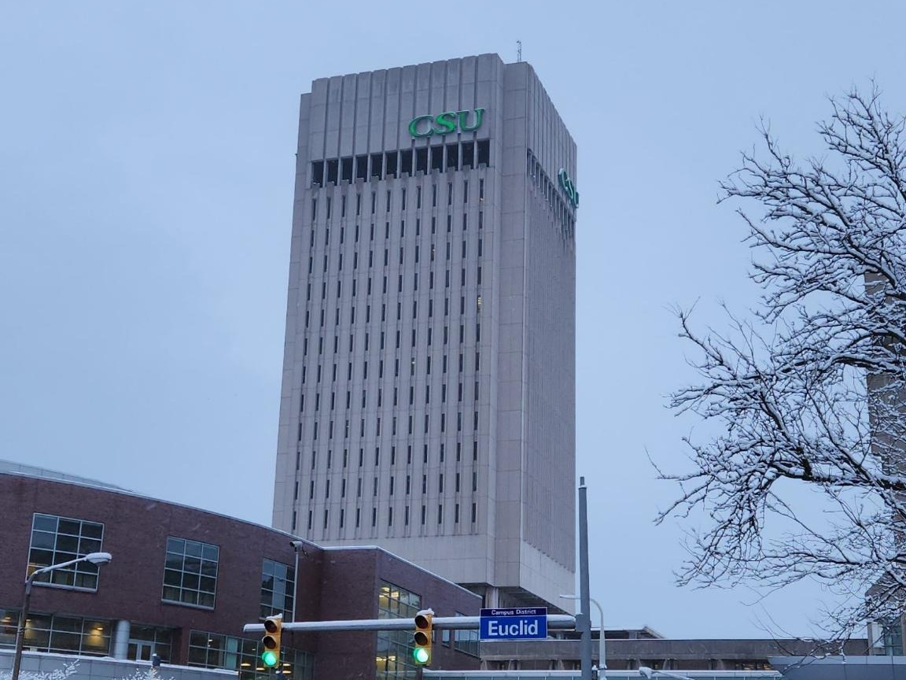
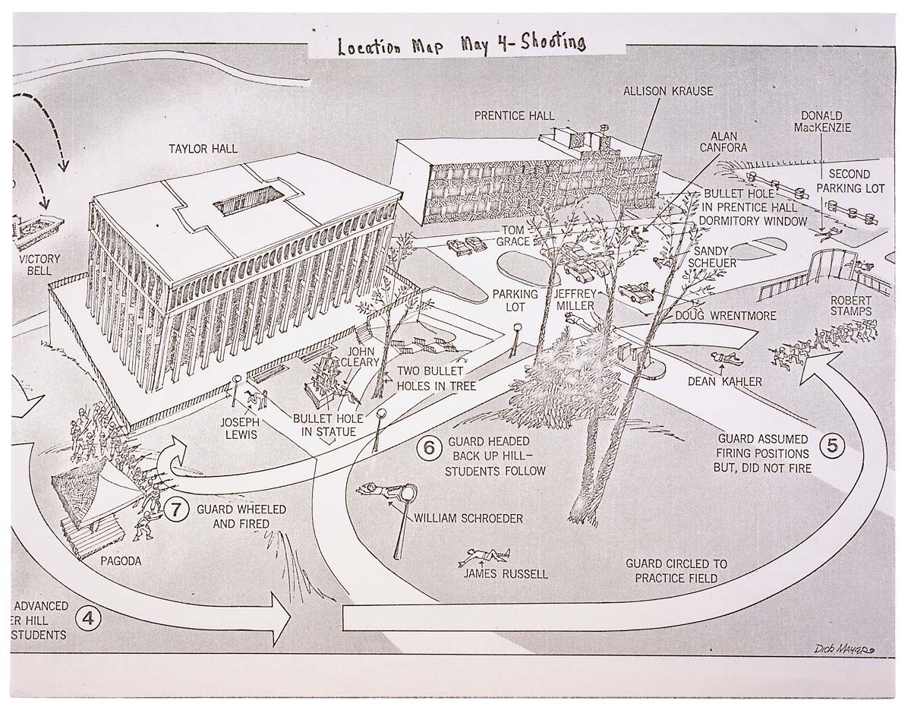

## TLDR

Rhodes Tower, the largest building at Cleveland State University and one of the most recognizable buildings in the Cleveland skyline,
is named after the governor who ordered the National Guard on Kent State University in 1970.
It received this name in 1981, *eleven years* after the Kent State shootings that left four college students dead.
**Rhodes Tower should be renamed.**

## Background

On May 4th, 1970 at 12:24 p.m., the Ohio National Guard opened fire on a peaceful rally of students protesting against the expansion of the Vietnam War into Cambodia[^1][^2].

Four students were shot and killed -
- [Jeffrey Glenn Miller](https://en.wikipedia.org/wiki/Jeffrey_Miller_(shooting_victim)), 20 years old
- [Allison Beth Krause](https://en.wikipedia.org/wiki/Allison_Krause), 19 years old
- [William Knox Schroeder](https://en.wikipedia.org/wiki/William_Knox_Schroeder), 19 years old
- [Sandra Lee Scheuer](https://en.wikipedia.org/wiki/Sandra_Lee_Scheuer), 20 years old

Nine others were wounded.

## James A. Rhodes

James Allen Rhodes served as Governor of Ohio from 1963 to 1971 and again from 1975 to 1983. It was Governor Rhodes who, following a request by Kent, Ohio mayor LeRoy Satrom, sent the Ohio National Guard to Kent State on May 3rd[^3][^4], resulting in the shootings the following day.

## Cleveland State University

On December 18, 1964, Governor Rhodes signed legislation that created Cleveland State University. James A. Rhodes Tower, more commonly known as Rhodes Tower, was constructed between 1968 and 1971. Initially called University Tower, it opened to the public on September 21, 1971.

University Tower was renamed to Rhodes Tower in 1981[^5], *ten years after its completion, eleven years after the shootings at Kent State*, and during the fourth term of Governor Rhodes.

**The largest, most recognizable symbol of higher education in Cleveland is named after the man responsible for the deaths of four students on another Ohio college campus.**

## Time for a Change

Rhodes Tower should be renamed. The tallest building at CSU should not be named after the man responsible for the deaths of four students. The name of Rhodes Tower is not representative of the public university that Cleveland deserves.

I am not a historical revisionist; I am not out to (retroactively) rewrite history. I do not seek to pursue superfluous linguistic squabbles as a means of bikeshedding solutions to more complex, pressing issues.

**I believe that our public institutions and the language with which we describe them reflect our values. It is within our collective power to rename Rhodes Tower.** We are the agents of our future. Rhodes Tower was called University Tower from 1971 to 1981. To rename it in 1981 was a conscious choice. So too is it a conscious choice to avoid renaming it in 2023.

[^1]: John Kifner (May 4, 1970). ["4 Kent State Students Killed by Troops"](https://www.nytimes.com/learning/general/onthisday/big/0504.html). The New York Times. [Archived](https://web.archive.org/web/20180126102558/http://www.nytimes.com/learning/general/onthisday/big/0504.html) from the original on January 26, 2018. Retrieved May 5, 2010. 
[^2]: Lewis, J. M., &amp; Hensley, T. R. (n.d.). ["The May 4 shootings at Kent State University: The search for historical accuracy"](https://www.kent.edu/may-4-historical-accuracy). Kent State University. [Archived](https://web.archive.org/web/20230123152839/https://www.kent.edu/may-4-historical-accuracy) from the original on January 23, 2023. Retrieved January 23, 2023. 
[^3]: National Governors Association. (n.d.). ["James Allen Rhodes"](https://www.nga.org/governor/james-allen-rhodes/). National Governors Association. [Archived](https://web.archive.org/web/20230123152705/https://www.nga.org/governor/james-allen-rhodes/) from the original on January 23, 2023. Retrieved January 23, 2023.
[^4]: Saxon, W. (2001, March 6). ["Gov. James Rhodes dies at 91; sent the guard to kent state"](https://www.nytimes.com/2001/03/06/us/gov-james-rhodes-dies-at-91-sent-the-guard-to-kent-state.html). The New York Times. Retrieved January 23, 2023.
[^5]: Wickens, J. (n.d.). ["Cleveland State University"](https://clevelandhistorical.org/items/show/77). Cleveland Historical. [Archived](https://web.archive.org/web/20230123152503/https://clevelandhistorical.org/items/show/77) from the original on January 23, 2023. Retrieved January 23, 2023.

